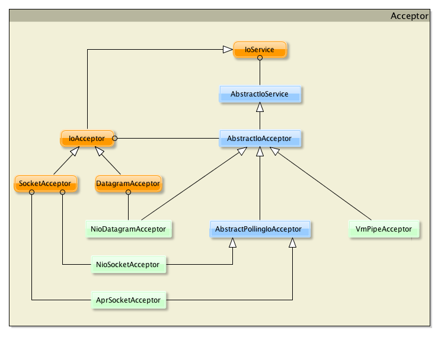

Acceptor
====

为了构建一个服务器，需要选择一个 IoAcceptor  接口的实现

## IoAcceptor

根本上讲，IoAcceptor 接口是因为 accept() 方法的缘故所命名，这个方法负责客户端和服务器端连接的创建。服务器端接收连入的连接请求。
        
某些情况下，我们可以把这一接口命名为 "Server" (将来的 MINA 3.0 中确实这样命名)。
        
因为我们可能要应对不止一种类型的传输协议 (TCP/UDP/...)，我们为这一接口提供了多个实现。不太可能需要你再实现一个新的。
        
我们具有以下具体实现类：

* NioSocketAcceptor：非阻塞套接字传输 IoAcceptor
* NioDatagramAcceptor：非阻塞 UDP 传输 IoAcceptor
* AprSocketAcceptor：基于 APR 的阻塞套接字传输 IoAcceptor
* VmPipeSocketAcceptor：in-VM IoAcceptor
        
你只需挑选一个适合你需要的。
        
这里是 IoAcceptor 接口和类的类图：

### 创建

首先你要选择想要实例化的 IoAcceptor 类型。在早期的过程中就应该做出这一选择，这取决于你将使用的网络协议。现在看一下它是如何工作的一个例子：

	public TcpServer() throws IOException {
	    // Create a TCP acceptor
	    IoAcceptor acceptor = new NioSocketAcceptor();
	
	    // Associate the acceptor to an IoHandler instance (your application)
	    acceptor.setHandler(this);
	
	    // Bind : this will start the server...
	    acceptor.bind(new InetSocketAddress(PORT));
	
	    System.out.println("Server started...");
	}

就是这样！你已经创建了一个 TCP 服务器。如果你想要启动一个 UDP 服务器，只需替换掉第一行代码：

	...
	// Create an UDP acceptor
	IoAcceptor acceptor = new NioDatagramAcceptor();
	...

### 销毁
        
服务可以通过调用 dispose() 方法进行停止。服务只能在所有等待中的 session 都被处理之后才能停止：

	// Stop the service, waiting for the pending sessions to be inactive
	acceptor.dispose();

你也可以通过传递给这个方法一个布尔类型的参数等待每一个执行中的线程正常结束：
	
	// Stop the service, waiting for the processing session to be properly completed
	acceptor.dispose( true );

### 状态
        
你可以通过调用以下方法之一拿到 IoService 的状态：

* isActive()：如果服务能够接受连入请求返回 true
* isDisposing()：如果 dispose() 方法已被调用返回 true。这并不能说明服务已经停止 (可能还有一些 session 正在处理中)
* isDisposed()：如果 dispose(boolean) 方法已被调用、并且执行中的线程已经结束，返回 true
        
### 管理 IoHandler
        
当服务实例化之后你可以添加或者获取其关联到的 IoHandler。你只需要去调用一把 setHandler(IoHandler) 或者 getHandler() 方法。
        
### 管理过滤器链
        
如果你想要管理过滤器链，你得调用一把 getFilterChain() 方法，如下所示：

	// Add a logger filter
	DefaultIoFilterChainBuilder chain = acceptor.getFilterChain();
	chain.addLast("logger", new LoggingFilter());

你也可以在将过滤器链设置进服务之前先创建它:

	// Add a logger filter
	DefaultIoFilterChainBuilder chain = new DefaultIoFilterChainBuilder();
	chain.addLast("logger", new LoggingFilter());
	
	// And inject the created chain builder in the service
	acceptor.setFilterChainBuilder(chain);