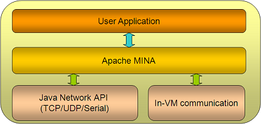

应用架构
====

问的最多的问题："一个基于 MINA 的应用看起来像什么"？本小节我们将来了解一下基于 MINA 的应用架构。我们收集了一些基于 MINA 的演示信息。
        
架构鸟瞰图

 这里，我们可以看到，MINA 是你的应用程序 (可能是一个客户端应用或者一个服务器端应用) 和基础网络层之间的粘合剂，可以基于 TCP、UDP、in-VM 通信甚至一个客户端的 RS-232C 串行协议。
        
你要做的仅仅是在 MINA 之上设计你自己的应用实现，而无需处理网络层的那些复杂业务。

现在我们再深入细节探讨一下。下图演示了 MINA 内部的更多细节，这正是每个 MINA 组件做的事情：

(上图来自 Emmanuel Lécharny 简报 [ MINA in real life (ApacheCon EU 2009)](http://mina.apache.org/staticresources/pdfs/Mina_in_real_life_ASEU-2009.pdf))

概况来讲，基于 MINA 的应用划分为三个层次：

* I/O Service (I/O 服务) - 具体 I/O 操作
* I/O Filter Chain (I/O 过滤器链) - 将字节过滤/转换为想要的数据结构。反之亦然
* I/O Handler (I/O 处理器) - 这里实现实际的业务逻辑

因此，要想创建一个基于 MINA 的应用，你需要：
        
1. 创建一个 I/O service - 从已存在的可用 service (*Acceptor) 中挑选一个或者创建你自己的
2. 创建一个 Filter Chain - 从现有 Filter 中挑选，或者创建一个用于转换请求/响应的自定义 Filter
3. 创建一个 I/O Handler - 处理不同消息时编写具体业务逻辑
        
具体创建基本就是如此。

接下来我们会对服务器端架构以及客户端架构进行更加深入阅读。
        
当然，MINA 提供的东东不仅于此，你可能会注意其他的一些方面的内容，比如消息加密/解密，网络配置如何扩大规模，等等... 我们在以后的几章中会对这些方面进一步讨论。