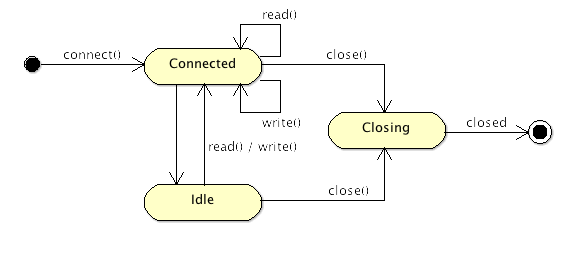

Session
====

Session（会话）是 MINA 的核心。每当一个客户端连接到服务器，一个新的会话会被创建，并会在客户端关掉连接前一直保存在内存中。
        
会话用于保存连接的持久信息，以及在请求处理过程中、会话的生命周期中服务器可能需要用到的任何信息。
        
## 会话的状态
        
会话会有一个随着时间演变的状态：

* 已连接：会话已被创建并可用
* 闲置：会话在至少一段时间 (这段时间是可配的) 内没有处理任何请求
	* 读闲置：在一段时间内没有任何读操作
	* 写闲置：在一段时间内没有任何写操作
	* 同时闲置：在一段时间内既没有读操作也没有写操作
* 关闭中：会话正在关闭中 (还有正在清空的消息，清理尚未结束)
* 已关闭：会话现在已被关闭，没有其他方法可以将其恢复。
        
以下状态图揭示了所有可能的状态及其转换：

## 配置

对于特定会话可以设置以下不同的参数：

* 接收缓冲大小
* 发送缓冲大小
* 空闲时间
* 写超时时间
        
另外还有一些其他配置，取决于你所用的传输类型 (参考[Chapter 6 - Transports](Chapter 6 - Transports.md))。

## 管理用户定义的属性
        
有可能需要存储一些以后可能会用到的数据。这个使用每个会话关联到的专用数据结构来实现。这是一个键值对组合，它可以存储开发人员可能希望保存的任何类型的数据。
       
例如，如果你想跟踪会话创建以后用户已发送的请求次数，把它放进集合很容易：只需要创建将要关联到这个值的键即可。

	...
	int counterValue = session.getAttribute( "counter" );
	session.setAttribute( "counter", counterValue + 1 );
	...

这样就有了将保存属性放进会话的方法：属性就是一个键值对，它可以从会话的容器中添加、删除以及读取。
        
容器在会话创建时会被自动创建，而在会话结束时会被清理。
        
## 定义容器
        
如上所述，容器是存储键值对的容器，默认情况下是一个 Map，但是也可以定义做其他的数据结构，如果你想处理长寿命周期的数据，或者避免将所有大数据都存储在内存：我们可以实现一个接口和一个工厂用于在会话建立时创建容器。
        
以下代码演示了会话初始化时容器的创建：

	protected final void initSession(IoSession session,
	        IoFuture future, IoSessionInitializer sessionInitializer) {
	    ...
	    try {
	        ((AbstractIoSession) session).setAttributeMap(session.getService()
	                .getSessionDataStructureFactory().getAttributeMap(session));
	    } catch (IoSessionInitializationException e) {
	        throw e;
	    } catch (Exception e) {
	        throw new IoSessionInitializationException(
	                "Failed to initialize an attributeMap.", e);
	    }
	    ...

  
如果我们想要定义其他类型的容器，这里是我们可以实现的工厂接口：

	public interface IoSessionDataStructureFactory {
	    /**
	     * Returns an {@link IoSessionAttributeMap} which is going to be associated
	     * with the specified <tt>session</tt>.  Please note that the returned
	     * implementation must be thread-safe.
	     */
	     IoSessionAttributeMap getAttributeMap(IoSession session) throws Exception;
	 }

## 过滤器链
        
每个会话会关联到一个过滤器链，在连入一个请求或者接收/发出消息时这个过滤器链将会对其处理。这些过滤器针对于每个每个单独的会话，在多数情况下，会为所有现有会话使用同一个过滤器链。
        
但是，也可以为单个会话动态修改过滤器链，比如为指定的会话的过滤器链添加一个日志过滤器。
        
## 统计
        
每个会话也会保持对会话处理结束的一些记录的跟踪：

* 接收或发送的字节数
* 接收或发送的消息数
* 闲置状态
* 吞吐量
        
以及其他一些有用的信息。
        
## 处理器
        
最后，并非最不重要的，每个会话会被附加到一个处理器，该处理器负责调度给你的应用的消息。这个处理器也会通过使用会话发送响应包，只需调用 write() 方法：

	...
	session.write( <your message> );
	...