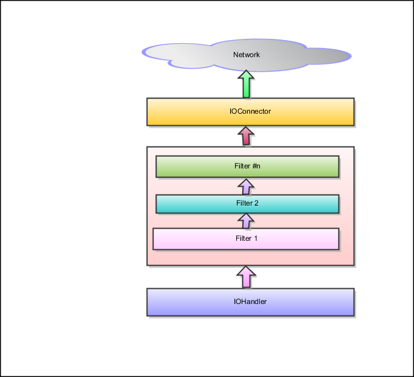

客户端架构
====

前面我们对基于 MINA 的服务端架构有了一个大体认识，现在我们看一下客户端的情况。客户端需要连接到一个服务端，发送消息并处理响应

* 客户端首先创建一个 IOConnector (用以连接 Socket 的 MINA Construct （构件）)，开启一个服务器的绑定
* 在连接创建时，一个 Session 会被创建并关联到该连接
* 应用或者客户端写入 Session，导致数据在穿越 Filter Chain (过滤器链) 后被发送给服务器端
* 所有接收自服务器端的响应或者消息穿越 Filter Chain (过滤器链) 后由 IOHandler 接收并处理