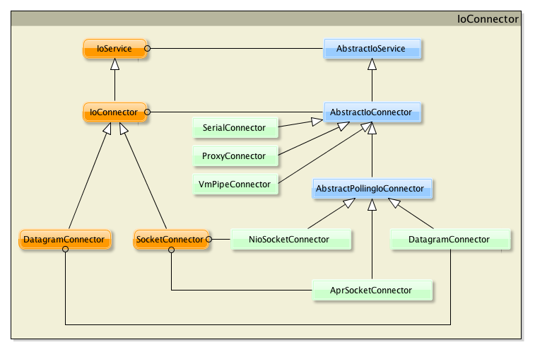

Connector
====

客户端应用，需要实现一个 IoConnector 接口的实现

## IoConnector

我们需要为客户端实现 IoConnector。我们提供了以下具体实现类：

* NioSocketConnector：非阻塞套接字传输 IoConnector
* NioDatagramConnector：非阻塞 UDP 传输 IoConnector
* AprSocketConnector：基于 APR 的阻塞套接字传输 IoConnector
* ProxyConnector：一个提供代理支持的 IoConnector
* SerialConnector：一个用于串行传输的 IoConnector
* VmPipeConnector：in-VM IoConnector
        
你只需挑选一个适合你需要的。
        
这里是 IoConnector 接口和类的类图：

