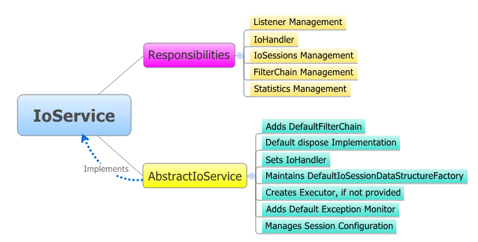

IoService 介绍
====

IoService 提供了基本的 I/O 服务，并对 MINA 中的 session 进行管理。它是 MINA 架构中的最重要的部分之一。IoService 及其子接口的实现类处理了绝大多数的低层 I/O 操作。

## IoService 脑图

我们来看一下 IoService 及其实现类 [AbstractIoService](http://mina.apache.org/mina-project/xref/org/apache/mina/core/service/AbstractIoService.html) 的职责。我们这次用一种稍微不同的方法，首先使用一个 [思维导图](http://en.wikipedia.org/wiki/Mind_map)，之后深入分析内部工作。这张思维导图由 [XMind](http://www.xmind.net/) 所画：

### 责任
        
由图中可以看出，IoService 承担着很多职责：

* session 管理：创建和删除 session，检测闲置 session
* 过滤器链管理：操纵过滤器链，允许用户运行中改变过滤器链
* 处理器调用：接收到新消息时调用处理器，等等
* 统计管理：更新发送消息的数量、发送字节的数量，等等
* 监听器管理：管理用户创建的监听器
* 通信管理：在服务器端和服务器端处理传输的数据

下面章节将会详述以上方面。

### 接口细节

IoService 是所有提供 I/O 服务和管理 I/O session 的 IoConnector 和 IoAcceptor 的基础接口。这一接口具有进行 I/O 相关操作的所有方法。
       
现在深入了解一下这个接口中的各种方法：

* getTransportMetadata()
* addListener()
* removeListener()
* isDisposing()
* isDisposed()
* dispose()
* getHandler()
* setHandler()
* getManagedSessions()
* getManagedSessionCount()
* getSessionConfig()
* getFilterChainBuilder()
* setFilterChainBuilder()
* getFilterChain()
* isActive()
* getActivationTime()
* broadcast()
* setSessionDataStructureFactory()
* getScheduledWriteBytes()
* getScheduledWriteMessages()
* getStatistics()

#### getTransportMetadata()

这一方法返回 IoAcceptor 或者 IoConnector 运行中传输的元数据。典型的细节包括提供者名 (nio、apr、rxtx)、连接类型 (面向无连接或有连接的) 等等。

#### addListener()

允许添加一个 IoServiceListener 以监听 IoService 关联到的特殊事件。

#### removeListener()

将附属于本 IoService 的 IoServiceListener 移除掉。

#### isDisposing()

这个方法指出服务是否正在被处理中。因为它可能需要一段时间，有必要知道服务的当前状态。

#### isDisposed()

这个方法指出服务是否已被处理结束。只有当其所分配的资源都被释放之后，这个服务才被认为是处理结束了。

#### dispose()

这一方法释放服务所分配的所有资源。因为它可能需要一段时间，用户应该使用 isDisposing() 和 isDisposed() 检测服务状态以了解服务是否已完全处理。
        
在你关闭一个服务时，记得调用 dispose()！

#### getHandler()

返回服务关联的 IoHandler。

#### setHandler()

设置将负责处理服务所有事件的 IoHandler。处理器包含你的应用逻辑！

#### getManagedSessions()

返回当前服务所管理的所有 session 集合。被管理的 session 是一个添加到服务监听器的 session。它将被用于处理闲置 session，以及其他 session 方面，取决于用户添加到服务的监听器的种类。

#### getManagedSessionCount()

返回当前服务所管理的 session 数量。

#### getSessionConfig()

返回 session 配置。

#### getFilterChainBuilder()

返回过滤器链构建者。这在用户想要添加在 session 创建时要被注入的新的过滤器时很有用。

#### setFilterChainBuilder()

定义服务使用的过滤器链构建者。

#### getFilterChain()

返回当前服务默认的过滤器链。

#### isActive()

返回服务是否是活动的。

#### getActivationTime()

返回服务激活的时间。如果服务不再是活动的，将返回服务最后的激活状态的时间点。

#### broadcast()

将给定消息写入所有管理的 session。

#### setSessionDataStructureFactory()

设置为当前服务所创建的新 session 提供相关数据结构的 IoSessionDataStructureFactory。

#### getScheduledWriteBytes()

返回计划要写入的字节的数量 (比如，保存在内存中，等待套接字写入的字节)。

#### getScheduledWriteMessages()

返回计划要写入的消息的数量 (比如，保存在内存中，等待套接字写入的消息)。

#### getStatistics()

返回当前服务的 IoServiceStatistics 对象。