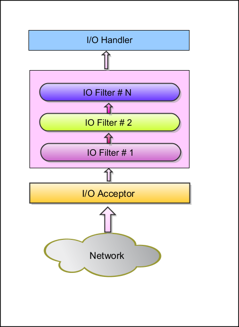

服务端架构
====

前面我们披露了基于 MINA 的应用架构。现在我们来关注一下服务器端架构。从根本上说，服务器端监听一个端口以获得连入的请求，将其进行处理然后发送回复。服务器端还会为每个客户端 (无论是基于 TCP 还是基于 UDP 协议的) 创建并维护一个 session，详见[Chapter 4 - Session](Chapter 4 - Session.md)。

* I/O Acceptor 监听网络以获取连入的连接或者包
* 对于一个新的连接，一个新的 session 会被创建，之后所有来自该 IP 地址/端口号组合的请求会在同一 session 中处理
* 在一个 session 中接收到的所有包，将穿越上图中所示的 Filter Chain (过滤器链)。过滤器可以被用于修正包的内容 (比如转化为对象，添加或者删除信息等等)。对于从原始字节到高层对象的相互转换，PacketEncoder/Decoder 相当有用。
* 包或转化来的对象最终交给 IOHandler。IOHandler 可以用于实现各种具体业务需求。

## session 的创建
        
只要一个客户端连接到了 MINA 服务器端，我们就要创建一个新的 session 以存放持久化数据。即使协议还没连接上，也要创建这么一个 session。
        
## 传入的消息处理

现在我们来解释 MINA 对连入消息的处理。
        
假定 session 已被创建，新传入的消息将导致一个 selector 被唤醒。

