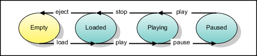

状态机
====

果你在使用 MINA 开发一个具有复杂网络的交互的应用，在某种情况下你可能会发现你自己试着使用经典的 [状态模式](http://home.earthlink.net/~huston2/dp/state.html) 以尝试解决其复杂性。但是，在你那么干之前，请检出查看  mina-statemachine 内容，它尝试去解决状态模式的一些缺陷。
        
### 一个简单的例子
        
我们来以一个简单示例来演示一下 mina-statemachine 是如何工作的。下图演示了一个典型的录音机的状态机。圆圈表示状态，箭头表示转换。每个转换以一个触发该转换的事件名作为标签。

首先，录音机处于 Empty 状态。插入一个磁带后 load 事件被触发，录音机转为 Loaded 状态。在 Loaded 状态中，eject 事件将会触发其移回 Empty 状态，而 play 事件则会触发其移向 Playing 状态。以此类推...我认为你可以判断出剩下的逻辑。
        
现在写一些代码。外界(与磁带机接口的代码)将会只能看到 TapeDeck 接口：

	public interface TapeDeck {
	    void load(String nameOfTape);
	    void eject();
	    void start();
	    void pause();
	    void stop();
	}

接下来我们写一下包含在状态机中的一个转变发生时要具体执行的代码的类。这些对象都被定义为常量字符串对象并以 @State 进行注解：

	public class TapeDeckHandler {
	    @State public static final String EMPTY   = "Empty";
	    @State public static final String LOADED  = "Loaded";
	    @State public static final String PLAYING = "Playing";
	    @State public static final String PAUSED  = "Paused";
	}

现在当状态被定义时，我们为每个转换建立相应的代码。每个转换将被对应到 TapeDeckHandler 中的一个方法。每个转换方法都使用 @Transition 进行注解，@Transition 定义了事件 id，该事件触发了转移 (on)、转移的开始状态 (in) 和转移的结束状态 (next)：

	public class TapeDeckHandler {
	    @State public static final String EMPTY = "Empty";
	    @State public static final String LOADED = "Loaded";
	    @State public static final String PLAYING = "Playing";
	    @State public static final String PAUSED = "Paused";
	
	    @Transition(on = "load", in = EMPTY, next = LOADED)
	    public void loadTape(String nameOfTape) {
	        System.out.println("Tape '" + nameOfTape + "' loaded");
	    }
	
	    @Transitions({
	        @Transition(on = "play", in = LOADED, next = PLAYING),
	        @Transition(on = "play", in = PAUSED, next = PLAYING)
	    })
	    public void playTape() {
	        System.out.println("Playing tape");
	    }
	
	    @Transition(on = "pause", in = PLAYING, next = PAUSED)
	    public void pauseTape() {
	        System.out.println("Tape paused");
	    }
	
	    @Transition(on = "stop", in = PLAYING, next = LOADED)
	    public void stopTape() {
	        System.out.println("Tape stopped");
	    }
	
	    @Transition(on = "eject", in = LOADED, next = EMPTY)
	    public void ejectTape() {
	        System.out.println("Tape ejected");
	    }
	}

请注意 TapeDeckHandler 类并没不实现 TapeDeck 接口。这是有意的。
现在，让我们来仔细看看这段代码。loadTape 方法上的 @Transition 注解

	@Transition(on = "load", in = EMPTY, next = LOADED)
	public void loadTape(String nameOfTape) {

定义了当录音机处于 EMPTY 状态时，load 事件发生了，loadTape 方法会被调用，然后录音机会转移到 LOADED 状态。pauseTape、stopTape 和 ejectTape 方法上的 @Transition 注解不需要更多说明。playTape 方法上的注解看起来略有不同。正如上图所见，当录音机处于 LOADED 或者 PAUSED 状态时，play 事件会播放磁带。为多个转移具有相同的方法调用，@Transitions 注解必须这样使用：

	@Transitions({
	    @Transition(on = "play", in = LOADED, next = PLAYING),
	    @Transition(on = "play", in = PAUSED, next = PLAYING)
	})
	public void playTape() {

@Transitions 注解简单为将被调用的带注解的方法列出了多个转移。
        
#### 更多关于 @Transition 参数

* 如果你忽略掉 on 参数，将默认为 "*"，这将匹配任何事件。
* 如果你忽略掉 next 参数，将默认为 "_self_"，这是当前状态的一个别名。要在你的状态机中创建一个循环转移，你只需忽略掉 next 参数即可。
* weight 参数可以被用于定义转移将被搜索的顺序。对于特定状态的转移将被根据他们的 weight 值升序排列。weight 默认为 0。
        
最后一步就是从注解的类中创建一个 StateMachine 对象，并用其创建一个实现了 TapeDeck 的代理对象：

	public static void main(String[] args) {
	    TapeDeckHandler handler = new TapeDeckHandler();
	    StateMachine sm = StateMachineFactory.getInstance(Transition.class).create(TapeDeckHandler.EMPTY, handler);
	    TapeDeck deck = new StateMachineProxyBuilder().create(TapeDeck.class, sm);
	
	    deck.load("The Knife - Silent Shout");
	    deck.play();
	    deck.pause();
	    deck.play();
	    deck.stop();
	    deck.eject();
	}

这些行

	TapeDeckHandler handler = new TapeDeckHandler();
	StateMachine sm = StateMachineFactory.getInstance(Transition.class).create(TapeDeckHandler.EMPTY, handler);

创建了来自 TapeDeckHandler 实例的 StateMachine 实例。StateMachineFactory.getInstance(...) 中调用 Transition.class 以告诉工厂我们已经用了 @Transition 注释来创建状态机。我们定义了 EMPTY 作为起始状态。一个 StateMachine 基本上是一个有向图。State 对象相当于图中的节点，Transition 对象相当于边界。我们在 TapeDeckHandler 中使用的每个 @Transition 相当于一个 Transition 实例。
        
*@Transition 和 Transition 之间的区别是什么？*

*@Transition 是一个用来标记当一个状态之间的移动发生时应该使用的一个方法。mina-statemachine 将在幕后为每个 @Transition 注释的方法创建 MethodTransition 类的实例。MethodTransition 实现了 Transition 接口。作为一个 mina-statemachine 用户你讲永远不会直接使用 Transition 或 MethodTransition 类型。*

        
TapeDeck 实例通过调用 StateMachineProxyBuilder 进行创建：

	TapeDeck deck = new StateMachineProxyBuilder().create(TapeDeck.class, sm);

StateMachineProxyBuilder.create() 方法获取返回代理对象应该实现的接口，将要接收这个方法生成的事件的 StateMachine 实例要求代理。
        
以上代码执行时的输出是为：

	Tape 'The Knife - Silent Shout' loaded
	Playing tape
	Tape paused
	Playing tape
	Tape stopped
	Tape ejected

*这些都和 MINA 有关吗？*
        
*你可能已经注意到了，在这个例子中没有任何 MINA 具体的事情。不要担心，稍后我们将会看一下如何为 MINA 的 IoHandler 接口创建状态机。*

## 它是如何工作的？
        
让我们了解一下当一个方法被代理调用会发生什么。
        
### 查找一个 StateContext  对象
        
StateContext 对象是很重要的，因为它持有当前状态。当一个方法被代理调用时它将请求一个 StateContextLookup 实例以从方法的参数中获取 StateContext。通常地，StateContextLookup 实现将会依次查通过方法的参数并寻找一个特定类型的对象，使用该对象来取到一个 StateContext 对象。如果没有任何 StateContext 被分配，StateContextLookup 将创建一个并将其存储在对象中。
        
在对 MINA 的 IoHandler 进行代理时，我们将使用一个 IoSessoinStateContextLookup 实例，它将在方法的参数中寻找一个 IoSession。它将使用 IoSession 的属性为每个 MINA 会话存储一个单独的 StateContext 实例。这样同一个状态机可以被所有 MINA 会话在不相互干扰的情况下进行共用。
        
*在上面的例子中，在我们使用 StateMachineProxyBuilder 创建代理时并没有指定具体 StateContextLookup 实现。如果不指定的话，将会使用 SingletonStateContextLookup。SingletonStateContextLookup 通常会无视传给它的方法参数 - 它将总是返回同一个 StateContext 对象。很明显，当同一个状态机同时被大量客户端所使用时这并没有多大用处*
        
### 将方法调用转换为一个事件对象
        
所有调用代理对象的方法都将被代理转换为事件对象。一个事件具有一个 id 和 0 或者更多参数。id 相当于方法的名字，事件参数相当于方法参数。调用 deck.load("The Knife - Silent Shout") 的方法相当于事件 {id = "load", arguments = ["The Knife - Silent Shout"]}。事件对象也包含一个对先前查找到的 StateContext 对象的引用。
        
### 调用 StateMachine
        
一旦事件对象被创建，代理将会调用 StateMachine.handle(Event)。StateMachine.handle(Event) 轮巡当前状态的 Transition 对象以寻找一个接收当前事件的 Transition 实例。在 Transition 找到后这个过程会停止。Transition 对象将会按照 weight (通常由 @Transition 注释所定义) 的顺序进行查找。
       
### 执行 Transition
        
最后一步是调用匹配 Event 的 Transition.execute(Event)。Transition 执行之后，StateMachine 会更新当前状态为 Transition 定义的最终状态。
        
*Transition 是个接口。每次你使用 @Transition 注解时一个 MethodTransition  对象将被创建。*
		
## MethodTransition
       
MethodTransition 很重要，需要进一步的解释。如果事件 id 匹配 @Transition 注解的参数 MethodTransition 匹配到该 Event，被注解方法的参数兼容事件的子集参数。
        
因此，如果 Event 看起来像 {id = "foo", arguments = [a, b, c]}，方法

	@Transition(on = "foo")
	public void someMethod(One one, Two two, Three three) { ... }

当且仅当 ((a instanceof One && b instanceof Two && c instanceof Three) == true) 时匹配。匹配的方法将被匹配的参数绑定到方法的参数的事件调用：

	someMethod(a, b, c);

*Integer、Double、Float 等等也匹配它们相对应的基本类型 int、double、float 等等。*
        
正如上面提到过，子集也会匹配：

	@Transition(on = "foo")
	public void someMethod(Two two) { ... }

当 ((a instanceof Two || b instanceof Two || c instanceof Two) == true) 时匹配。这种情况下，当 someMethod  被调用时，第一个匹配事件参数将被绑定到参数名为 two  的方法。
        
没有任何参数的方法常常会在事件 id 匹配以下时匹配到：

	@Transition(on = "foo")
	public void someMethod() { ... }

让事情更复杂，前两个方法参数也会匹配 Event 类和 StateContext 接口。这意味着

	@Transition(on = "foo")
	public void someMethod(Event event, StateContext context, One one, Two two, Three three) { ... }
	@Transition(on = "foo")
	public void someMethod(Event event, One one, Two two, Three three) { ... }
	@Transition(on = "foo")
	public void someMethod(StateContext context, One one, Two two, Three three) { ... }

也匹配 Event {id = "foo", arguments = [a, b, c]} if ((a instanceof One && b instanceof Two && c instanceof Three) == true)。在 someMethod 被调用时，当前 Event 对象将被绑定到事件方法参数，当前 StateContext 会被绑定到上下文。
        
像以前一样可以使用事件参数的一个子集。另外，一个特定 StateContext 实现可能会被定义以取代石油泛型接口：

	@Transition(on = "foo")
	public void someMethod(MyStateContext context, Two two) { ... }

*方法参数的顺序很重要。如果方法需要访问当前 Event，那么它必须定义为第一个方法参数。StateContext 必须是第一个参数，或者是第二个参数 (在第一个参数是 Event 的情况下)。事件参数也必须匹配当前顺序。MethodTransition 不会试着对事件参数重新排序以寻找一个匹配。*
       
如果你做到这一步，恭喜！我知道上面的部分可能有点难以消化。我希望一些例子可以让事情清晰一些：
        
考虑一下 Event {id = "messageReceived", arguments = [ArrayList a = [...], Integer b = 1024]}。以下方法匹配这一 Event：

	// All method arguments matches all event arguments directly
	@Transition(on = "messageReceived")
	public void messageReceived(ArrayList l, Integer i) { ... }
	
	// Matches since ((a instanceof List && b instanceof Number) == true)
	@Transition(on = "messageReceived")
	public void messageReceived(List l, Number n) { ... }
	
	// Matches since ((b instanceof Number) == true)
	@Transition(on = "messageReceived")
	public void messageReceived(Number n) { ... }
	
	// Methods with no arguments always matches
	@Transition(on = "messageReceived")
	public void messageReceived() { ... }
	
	// Methods only interested in the current Event or StateContext always matches
	@Transition(on = "messageReceived")
	public void messageReceived(StateContext context) { ... }
	
	// Matches since ((a instanceof Collection) == true)
	@Transition(on = "messageReceived")
	public void messageReceived(Event event, Collection c) { ... }

以下则不能够匹配：

	// Incorrect ordering
	@Transition(on = "messageReceived")
	public void messageReceived(Integer i, List l) { ... }
	
	// ((a instanceof LinkedList) == false)
	@Transition(on = "messageReceived")
	public void messageReceived(LinkedList l, Number n) { ... }
	
	// Event must be first argument
	@Transition(on = "messageReceived")
	public void messageReceived(ArrayList l, Event event) { ... }
	
	// StateContext must be second argument if Event is used
	@Transition(on = "messageReceived")
	public void messageReceived(Event event, ArrayList l, StateContext context) { ... }
	
	// Event must come before StateContext
	@Transition(on = "messageReceived")
	public void messageReceived(StateContext context, Event event) { ... }

###  状态继承
        
状态实例可能具有一个父状态。如果 StateMachine.handle(Event) 无法在当前状态中找到匹配当前 Event 的 Transition，它将查找父状态。如果仍旧没有找到匹配的，父状态的父状态将被查找，以此类推。
        
当你想要添加一些泛型代码到所有状态而没有为每个状态定义 @Transition 时这一特性很有用。这里是如何使用 @State 注解创建状态层次的例子：

	@State    public static final String A = "A";
	@State(A) public static final String B = "A->B";
	@State(A) public static final String C = "A->C";
	@State(B) public static final String D = "A->B->D";
	@State(C) public static final String E = "A->C->E";

### 使用状态继承时的错误处理
        
现在回到 TapeDeck 例子。当录音机中没有磁带时如果你调用 deck.play() 会发生什么呢？我们试一下：

	public static void main(String[] args) {
	    ...
	    deck.load("The Knife - Silent Shout");
	    deck.play();
	    deck.pause();
	    deck.play();
	    deck.stop();
	    deck.eject();
	    deck.play();
	}
	
	...
	Tape stopped
	Tape ejected
	Exception in thread "main" o.a.m.sm.event.UnhandledEventException: 
	Unhandled event: org.apache.mina.statemachine.event.Event@15eb0a9[id=play,...]
	    at org.apache.mina.statemachine.StateMachine.handle(StateMachine.java:285)
	    at org.apache.mina.statemachine.StateMachine.processEvents(StateMachine.java:142)
	    ...

噢哟！我们得到一个 UnhandledEventException，因为我们处于 Empty 状态，没有任何处理 play 事件的转移。我们可以为所有的状态添加一个特殊的移动，用以处理不匹配的 Event 对象：

	@Transitions({
	    @Transition(on = "*", in = EMPTY, weight = 100),
	    @Transition(on = "*", in = LOADED, weight = 100),
	    @Transition(on = "*", in = PLAYING, weight = 100),
	    @Transition(on = "*", in = PAUSED, weight = 100)
	})
	public void error(Event event) {
	    System.out.println("Cannot '" + event.getId() + "' at this time");
	}

现在你在运行上面的 main() 方法时就不会遭遇到异常了。输出是为：
	
	...
	Tape stopped
	Tape ejected
	Cannot 'play' at this time

现在貌似工作良好了，是么？但是如果我们有 30 个状态，而不仅仅是 4 个呢？然后我们要需要在 error() 方法上加 30 个 @Transition 注解了。不怎么好。可以使用状态继承替代这种做法：
	
	public static class TapeDeckHandler {
	    @State public static final String ROOT = "Root";
	    @State(ROOT) public static final String EMPTY = "Empty";
	    @State(ROOT) public static final String LOADED = "Loaded";
	    @State(ROOT) public static final String PLAYING = "Playing";
	    @State(ROOT) public static final String PAUSED = "Paused";
	
	    ...
	
	    @Transition(on = "*", in = ROOT)
	    public void error(Event event) {
	        System.out.println("Cannot '" + event.getId() + "' at this time");
	    }
	}

结果是一样的，但最后一个方法让我们在维护的时候事情变得更加简单了。
       
### mina-statemachine 使用 IoHandler
        
现在我们要转化我们的录音机为一个 TCP 服务器，然后使用更多功能对其进行扩展。这个服务器将会接收一些命令注入 load、play、stop 等等。服务器可以以 positive + 或者 negative - 进行响应。协议是基于文本的，所有命令和响应都是一行行的 UTF-8 文本，并以 CRLF (比如，Java 中是 \r\n) 终结。这里是一个会话示例：
	
	telnet localhost 12345
	S: + Greetings from your tape deck!
	C: list
	S: + (1: "The Knife - Silent Shout", 2: "Kings of convenience - Riot on an empty street")
	C: load 1
	S: + "The Knife - Silent Shout" loaded
	C: play
	S: + Playing "The Knife - Silent Shout"
	C: pause
	S: + "The Knife - Silent Shout" paused
	C: play
	S: + Playing "The Knife - Silent Shout"
	C: info
	S: + Tape deck is playing. Current tape: "The Knife - Silent Shout"
	C: eject
	S: - Cannot eject while playing
	C: stop
	S: + "The Knife - Silent Shout" stopped
	C: eject
	S: + "The Knife - Silent Shout" ejected
	C: quit
	S: + Bye! Please come back!

这一会话中所描述到的 TapeDeckServer 的完整代码可以在 svn 库里的 mina-example 模块的 org.apache.mina.example.tapedeck 包中找到。代码使用了 MINA 的 ProtocolCodecFilter 来将字节转化为命令对象 (反之亦然)。有一个为每个服务器识别的请求类型的 Command 实现。这里我们不会描述编解码器实现在任何细节。
        
现在，看一下服务器是如何工作的。实现了状态机的重要的类是 TapeDeckServer。我们要做的第一件事是定义状态：

	@State public static final String ROOT = "Root";
	@State(ROOT) public static final String EMPTY = "Empty";
	@State(ROOT) public static final String LOADED = "Loaded";
	@State(ROOT) public static final String PLAYING = "Playing";
	@State(ROOT) public static final String PAUSED = "Paused";

没有任何新东西。但是，处理事件的方法现在看起来不一样了。我们看一下 playTape 方法：
	
	@IoHandlerTransitions({
	    @IoHandlerTransition(on = MESSAGE_RECEIVED, in = LOADED, next = PLAYING),
	    @IoHandlerTransition(on = MESSAGE_RECEIVED, in = PAUSED, next = PLAYING)
	})
	public void playTape(TapeDeckContext context, IoSession session, PlayCommand cmd) {
	    session.write("+ Playing \"" + context.tapeName + "\"");
	}

代码没有使用前面使用的常规 @Transition 和 @Transitions 注解，用的是 MINA 特定的 @IoHandlerTransition 和 @IoHandlerTransitions 注解。这是为 MINA 的 IoHandler 接口创建状态机时的首选，因为它们可以让你为事件 id 使用一个 Java 枚举，而不是前面例子中所用到的字符串。它们也是为 MINA 的 IoFilter 接口所对应的注解。
        
我们使用 MESSAGE_RECEIVED 取代了 "play" 作为事件名 (@IoHandlerTransition 注解的 on 属性)。这一常量定义于 org.apache.mina.statemachine.event.IoHandlerEvents，值是为 "messageReceived"，自然对应于 MINA 的 IoHandler 接口的 messageReceived() 方法。多亏 Java5 的静态导入，我们不需要去写出持有该变量的类名。我们只需要把

	import static org.apache.mina.statemachine.event.IoHandlerEvents.*;

声明放在导入部分中即可。
        
发生变化的另一件事是我们使用的是一个自定义的 StateContext 实现，TapeDeckContext。这个类用于跟踪当前磁带的名称：

	static class TapeDeckContext extends AbstractStateContext {
	    public String tapeName;
	}

*为什么不把磁带名称存储在 IoSession？*

*我们可以将磁带名作为一个属性存储在 IoSession 中，但是推荐使用一个自定义的 StateContext，因为它提供类型安全。*

关于 playTape() 方法要注意的最后一件事是它以一个 PlayCommand 作为其最后一个参数。最后参数对应于 IoHandler 的 messageReceived(IoSession session, Object message) 方法的 message 参数。这意味着 playTape() 将只在客户端饭送的字节可以被解码为一个 PlayCommand 时才被调用到。
        
在录音机能够播放之前必须得先放进一个磁带。当从客户端接收到 LoadCommand 时，提供的磁带号将被用于从一个磁带的数组中获取该磁带名：

	@IoHandlerTransition(on = MESSAGE_RECEIVED, in = EMPTY, next = LOADED)
	public void loadTape(TapeDeckContext context, IoSession session, LoadCommand cmd) {
	    if (cmd.getTapeNumber() < 1 || cmd.getTapeNumber() > tapes.length) {
	        session.write("- Unknown tape number: " + cmd.getTapeNumber());
	        StateControl.breakAndGotoNext(EMPTY);
	    } else {
	        context.tapeName = tapes[cmd.getTapeNumber() - 1];
	        session.write("+ \"" + context.tapeName + "\" loaded");
	    }
	}

代码使用 StateControl 来覆盖下一状态。如果用户指定了一个未知磁带号，我们不应该移至 LOADED 状态，而应该继续保持 EMPTY，

	StateControl.breakAndGotoNext(EMPTY);

正如上行代码一样。StateControl 类稍后进行描述。
        
connect() 方法应该总是在会话的起始时 (当 MINA 调用 IoHandler 的 sessionOpened() 时) 被调用：
	
	@IoHandlerTransition(on = SESSION_OPENED, in = EMPTY)
	public void connect(IoSession session) {
	    session.write("+ Greetings from your tape deck!");
	}

它做的所有事情只是给客户端写了一个致意。状态机将保持为 EMPTY 状态。
        
pauseTape()、stopTape() 和 ejectTape() 方法非常类似于 playTape()，这里不再赘述。listTapes()、info() 和 quit() 方法现在也应该简单明了了吧。请注意后面这三个方法被用于 ROOT 状态。这意味着 list、info 和 quit 明令可以出现在任何状态。
        
现在我们来看一下错误处理。error() 方法将在客户端发送一个对当前状态不合法的命令时被调用：

	@IoHandlerTransition(on = MESSAGE_RECEIVED, in = ROOT, weight = 10)
	public void error(Event event, StateContext context, IoSession session, Command cmd) {
	    session.write("- Cannot " + cmd.getName() + " while " 
	           + context.getCurrentState().getId().toLowerCase());
	}
 
error() 占用的权重比 listTapes()、info() 和 quit() 要高，以防止它被这些命令所调用。注意 error() 是如何使用 StateContext 对象来获得当前状态的 id 的。用于注解 @State 的字符串常量的值将被 mina-statemachine 用作状态 id。
        
commandSyntaxError() 方法将在一个 CommandSyntaxException 被我们的 ProtocolDecoder 抛出后被调用。它简单打印出客户端发送的行无法被转换为一个 Command。
        
exceptionCaught() 将被为所有抛出的异常而调用，除了 CommandSyntaxException 异常 (它具有一个比 commandSyntaxError() 方法更高的权重)。它将立即关闭会话。
        
最后一个 @IoHandlerTransition 方法是 unhandledEvent()，它将在没有任何其他 @IoHandlerTransition 方法匹配 Event 时被调用。我们需要这样，因为我们没有在所有状态中为所有可能类型的事件加上 @IoHandlerTransition 注解 (比如，我们从没对 messageSent 事件进行处理)。否则如果一个 Event 被状态机处理的话 mina-statemachine 会抛一个异常。
        
我们需要看的最后一块代码是为创建 IoHandler 代理的代码和 main() 方法：

	private static IoHandler createIoHandler() {
	    StateMachine sm = StateMachineFactory.getInstance(IoHandlerTransition.class).create(EMPTY, new TapeDeckServer());
	
	    return new StateMachineProxyBuilder().setStateContextLookup(
	            new IoSessionStateContextLookup(new StateContextFactory() {
	                public StateContext create() {
	                    return new TapeDeckContext();
	                }
	            })).create(IoHandler.class, sm);
	}
	
	// This code will work with MINA 1.0/1.1:
	public static void main(String[] args) throws Exception {
	    SocketAcceptor acceptor = new SocketAcceptor();
	    SocketAcceptorConfig config = new SocketAcceptorConfig();
	    config.setReuseAddress(true);
	    ProtocolCodecFilter pcf = new ProtocolCodecFilter(
	            new TextLineEncoder(), new CommandDecoder());
	    config.getFilterChain().addLast("codec", pcf);
	    acceptor.bind(new InetSocketAddress(12345), createIoHandler(), config);
	}
	
	// This code will work with MINA trunk:
	public static void main(String[] args) throws Exception {
	    SocketAcceptor acceptor = new NioSocketAcceptor();
	    acceptor.setReuseAddress(true);
	    ProtocolCodecFilter pcf = new ProtocolCodecFilter(
	            new TextLineEncoder(), new CommandDecoder());
	    acceptor.getFilterChain().addLast("codec", pcf);
	    acceptor.setHandler(createIoHandler());
	    acceptor.setLocalAddress(new InetSocketAddress(PORT));
	    acceptor.bind();
	}

除了在对 StateMachineFactory.getInstance(...) 调用中定义了 IoHandlerTransition.class 取代 Transition.classcreateIoHandler() 之外，createIoHandler() 就像我们之前干的那样创建了一个 StateMachine。这是必须的，因为我们现在用的是 @IoHandlerTransition 注解。另外，在我们创建 IoHandler  代理时，这次我们使用 IoSessionStateContextLookup  和一个自定义的 StateContextFactory。如果我们不使用 IoSessionStateContextLookup 的话，所有客户端将分享一个并不合适的状态机。
        
main() 方法创建了 SocketAcceptor 和 ProtocolCodecFilter，ProtocolCodecFilter 为其过滤器链对 Command 对象进行编码和解码。最后，使用被 createIoHandler() 方法创建的一个 IoHandler 实例绑定到端口 12345。
		
## 扩展主题
        
### 通过编程改变状态

未完待续...
        
### 递归调用状态机

未完待续...